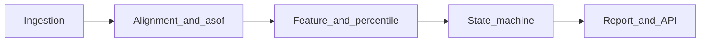

# 黄金与比特币「聪明钱 / 风险状态」产品需求说明（PRD）

**文档版本**：1.0  
**读者**：实现工程师、后续 Claude / 量化与数据同学  
**语言**：中文为主，关键术语附英文  

---

## 1. 背景与目标

### 1.1 问题陈述

个人投资者希望用**可溯源、可复现**的公开数据，刻画**黄金（Gold）**与**比特币（Bitcoin / BTC）**在一段时间内的：

- **宏观与流动性环境（Regime）**
- **仓位与杠杆拥挤度（Positioning）**
- **波动与趋势结构（Volatility / Trend）**

并输出有限的、可解释的**风险状态标签**（例如：更适合累积与定投、中性观望、或更适合降风险），作为**个人决策框架**的输入之一。

### 1.2 非目标（明确不做）

- **不**声称提供「全球顶级机构过去一周真实成交流水」或任何非公开订单级数据。
- **不**提供个性化投资建议、税务/法律意见，或保证收益与卖点的「喊单」系统。
- **不**在本文档或代码库中硬编码 **API 密钥、令牌、私钥**（凭证仅允许来自环境变量或密钥管理）。

### 1.3 成功标准（实现阶段可验收）

- 每条指标可追溯到**数据来源类型**与**发布延迟**说明。
- 任意日期的评分与标签，仅使用在该日期**已公开可得**（`published_at` 之前）的数据序列。
- 输出除标签外，附带**人类可读解释**（哪些维度驱动了状态变化）。
- 固定展示**免责声明**与措辞规范（见第 9 节）。

---

## 2. 核心概念

### 2.1 「聪明钱」的操作化定义

本系统中的「聪明钱 / 机构行为」**不等同于**某家具体基金的真实下单，而是指一组**公开代理指标（proxies）**，用于描述：

- 期货与衍生品上的**分类参与者净头寸**（如 CFTC COT）
- ETF 等工具上的**持仓与资金边际变化**
- 加密市场上**杠杆、流动性与筹码迁移**的统计结构

### 2.2 三层分离（必须贯彻到架构）

| 层级 | 英文 | 回答的问题 | 典型输入 |
|------|------|------------|----------|
| 环境层 | Regime | 当前大类资产定价背景顺风还是逆风？ | 实际利率、美元、风险情绪等 |
| 仓位层 | Positioning | 是否拥挤、杠杆是否过高？ | COT、Funding、OI、ETF 流等 |
| 执行层 | Execution | 如何下单以减少冲击与情绪化？ | 定投、分批、斐波那契带等 |

**规则**：环境顺风**不能**单独推翻「杠杆拥挤极端」触发的降风险信号；执行层工具**不能**单独触发加仓而不经仓位层校验。

---

## 3. 黄金指标组（Metrics）

下列表格为**逻辑规格**；具体数据供应商、字段名与 endpoint 在实现阶段选定，须与本表语义对齐。

**表列说明**：指标名 | 含义 | 建议频率 | 典型发布 / 修订延迟 | 方向性解读（摘要）| 主要局限

| 指标名 | 含义 | 建议频率 | 典型延迟 | 方向性解读（摘要）| 主要局限 |
|--------|------|----------|----------|-------------------|----------|
| 实际利率代理（Real yields） | 常用如 **10Y TIPS** 收益率，作黄金机会成本方向线索 | 日 | 日终可得；修订随官方数据 | 实际利率**上行**常对金价**偏逆风**（非恒等） | 与金价非稳定线性；其他因子（央行购金等）未单独建模 |
| 美元指数（DXY） | 美元强弱广谱代理 | 日 | 日终 | **过强**常对以美元计价的黄金**偏压** | DXY 篮子与黄金定价因子不完全重合 |
| 风险情绪代理（Risk sentiment） | 如 **VIX**、或投资级信用利差等 | 日 | 日终 | 恐慌**飙升**阶段黄金常呈避险需求，但亦伴流动性冲击 | 危机周「卖一切」时黄金也可能短期承压 |
| CFTC COT（黄金期货） | **分类交易者**在 COMEX 等合约上的净头寸与多空分布 | 周 | 通常**滞后数个交易日**发布；有报告周截止日 | 净投机多头**极端高** → 回撤风险上升（拥挤）；极端低 → 悲观拥挤（均值回复线索，非买入指令） | **期货≠现货全市场**；商业套保与投机分类解读需一致口径 |
| 黄金 ETF 持仓 / 资金流 | 如 GLD 等规模与申赎方向 | 日 / 周汇总 | 通常 T+1 内可得概览 | 持续净流入 → 中长期配置需求边际**偏强**（亦含被动与再平衡） | 无法区分「聪明」与「跟风」；大份额创设/赎回有技术性因素 |
| 历史波动率 / ATR%（HV / ATR%） | 金价波动幅度占价比 | 日 | 日终 | **高波动** → 单笔大额冲击大，**执行层**倾向定投或缩小单笔 | 波动聚簇；高波动可持续很久 |
| 中期趋势结构（Trend） | 如相对 **200 日均线**位置、或规则化突破系统 | 日 | 日终 | 用于**趋势破坏**类降风险子规则（占位，阈值样本外校准） | 均线策略滞后；参数敏感 |

**与现货金价的关系（强制说明文案）**：COT 与 ETF 流反映的是**特定市场切片**（期货参与者、ETF 通道），不能等同于全球实物黄金供需或央行储备的完整账本。

---

## 4. 比特币指标组（Metrics）

| 指标名 | 含义 | 建议频率 | 典型延迟 | 方向性解读（摘要）| 主要局限 |
|--------|------|----------|----------|-------------------|----------|
| 永续资金费率（Perp funding） | 永续合约多头向空头或反向支付的费用强度 | 8h / 日聚合 | 近乎实时；聚合为日 | **持续显著为正** → 多头杠杆拥挤**风险上升**（非精确卖点） | 不同交易所口径不同；需统一来源或中位数 |
| 未平仓合约 + 价格（OI + Price） | OI 与价格同向快速上升 | 日 / 更高频汇总 | 近实时 | **杠杆驱动上涨**环境下，流动性逆转时波动放大 | OI 含套利腿；跨所加总需去重规则 |
| 交易所余额 / 净流入（Exchange balances / flows） | 链上标签下的交易所地址余额变化或净流入 | 日 | 依索引商，通常 T+0～T+1 | 余额**上升**常被解读为潜在抛压增加（**弱信号**） | **内部划转、标签错误**导致假信号；必须固定口径并文档化 |
| 稳定币供给 / 流向（Stablecoins） | 如主要稳定币市值或净流入交易所 | 日 | 依源 | 宽松稳定币环境常利于加密流动性（**环境辅助**） | 监管与脱锚事件可突变；非因果 |
| 链上大额转账（Whale alerts，可选） | 大额 UTXO 或账户模型转账计数/体量 | 日 | 近实时 | 仅作**结构背景**；不单独驱动交易 | 无法区分托管调仓与用户真实意图 |
| 历史波动率 / ATR% | 同黄金 | 日 | 日终 | 高波动 → 执行层倾向分批 | 与黄金类似 |
| 中期趋势结构 | 同黄金逻辑，标的为 BTC | 日 | 日终 | 趋势破坏 → 可触发 DE_RISK 子类 | 同黄金 |

---

## 5. 斐波那契回撤 / 扩展（Fibonacci，可选执行层）

### 5.1 定义

- **斐波那契回撤 / 扩展**：在图表上选取 **Swing High / Swing Low**（摆动高、低点）后，按 **23.6%、38.2%、50%、61.8%、78.6%** 等比例绘制支撑 / 阻力带的技术工具。
- 交易文献中的 **1、2、3、5、8**（斐波那契数列）常见于**波浪理论或时间周期**讨论，与**回撤比例工具**不是同一概念；产品文档与 UI **不得**混称为「同一套神奇数字」。

### 5.2 在本系统中的定位

- **仅属于 Execution（执行层）**：用于「分批加仓 / 分批止盈」的区间参考。
- **必须**服从：
  - 仓位层：Funding / OI / COT 等未处于「极端拥挤」否决状态；
  - 环境层：未处于统一 DE_RISK 的宏观否决（若实现否决规则）。
- **必须**披露局限：摆动点选择主观；换点则比例线整体平移，易产生**后验拟合**观感。

### 5.3 与状态机的关系

斐波那契**不得**作为 `ACCUMULATE` / `DE_RISK` 的**唯一**触发条件；最多作为同状态下的**执行细化**（子模块）。

---

## 6. 三态状态机（产品输出）

### 6.1 输出枚举

| 状态代码 | 展示名（示例） | 含义（对用户文案） |
|----------|----------------|-------------------|
| `ACCUMULATE` | 累积 / 定投友好 | 环境或结构未显著恶化，拥挤度可控；**倾向**按计划分批或定投（非保证收益）。 |
| `NEUTRAL` | 中性 / 观望 | 信号冲突或强度不足；不建议因本系统单独大幅改变仓位。 |
| `DE_RISK` | 降风险 | 拥挤、杠杆、波动或趋势结构触发；**倾向**降低杠杆、减仓或暂停加码 / 暂停定投（由用户规则细化）。 |

### 6.2 输入构建（实现建议）

1. 对每个原始指标计算滚动窗口内的**历史分位**（0–100）或 **z-score**，窗口长度按指标特性分别配置（文档占位，实现时写入配置文件）。
2. 将指标按第 2.2 节归入 **Regime / Positioning / Execution**。
3. 合成**子分数**（示例）：
   - `score_regime_gold`、`score_positioning_gold`、`score_regime_btc`、`score_positioning_btc`
4. **具体阈值与权重**：本文档**不**写死数值，标注为「需 walk-forward / 样本外校准」；MVP 可采用等权中位数与保守默认（实现阶段记录于 `config`）。

### 6.3 冲突解决优先级（规范）

以下优先级**高于**任何单一指标顺风信号（从高到低）：

1. **安全与数据**：当日关键数据缺失超过约定比例 → `NEUTRAL` 或降级为「数据不足」子状态（不猜测）。
2. **杠杆 / 拥挤否决（Veto）**：
   - BTC：Funding 与 OI 联合满足「极端拥挤」规则 → 至少 `NEUTRAL`，满足更强条件 → `DE_RISK`。
   - 黄金：COT 净投机多头处于历史极端上分位 → 禁止输出 `ACCUMULATE`，倾向 `NEUTRAL` 或 `DE_RISK`（具体由校准决定）。
3. **趋势结构破坏（Trend break）**：满足「中期趋势破坏」规则 → 可触发 `DE_RISK` **子类**（如：仅停止定投、或建议减仓比例区间）。
4. **宏观环境（Regime）**：在未被 1–3 否决时，参与 `ACCUMULATE` vs `NEUTRAL` 的区分。

**决策表示例（逻辑，非代码）**：

```text
IF data_insufficient THEN NEUTRAL + explanation
ELSE IF btc_leverage_extreme OR gold_cot_extreme THEN DE_RISK or NEUTRAL (per calibration)
ELSE IF trend_broken(asset) THEN DE_RISK (subtype)
ELSE IF regime_favorable AND NOT crowded THEN ACCUMULATE
ELSE NEUTRAL
```

### 6.4 人类可读解释（必选输出字段）

每次状态变更或定期报告中，至少包含：

- **主导维度**：Regime / Positioning / Trend 中哪一类贡献最大。
- **Top 3 驱动指标**：名称 + 当前分位方向（例如「Funding 位于 90 日 92% 分位」）。
- **数据可得性**：各指标最近 `published_at`。

---

## 7. 数据治理与时间对齐

### 7.1 双时间戳（强制）

每条观测必须存储：

| 字段 | 含义 |
|------|------|
| `as_of` | 指标所描述的市场日期或报告周截止日（业务日期） |
| `published_at` | 该值在真实世界中可被用户获得的最早时间（UTC） |

**防 lookahead（窥视未来）规则**：在日期 `D` 生成的评分与标签，仅允许使用满足 `published_at <= D_end_of_trading`（或实现中定义的「决策时点」）的观测序列。

### 7.2 时区

- 存储：**UTC**。
- 展示：默认 **US/Eastern** 或与用户配置一致；在 UI 标明。

### 7.3 对齐与缺失

- 不同频率（日 / 周）对齐策略：**前向填充（forward fill）仅允许用已发布值**；禁止用未来周 COT 填充当前周。
- 缺失率超阈值 → 不输出强结论，降级 `NEUTRAL` 并记录告警。

---

## 8. 验证与质量

### 8.1 回测与验证原则

- 任何声称「优化过」的阈值与权重，须经过 **walk-forward** 或严格 **样本外** 评估；训练集不得包含实现时尚未发布的数据。
- 报告至少区分：**方向准确率**、**校准后的概率质量**、**最大回撤**（若绑定简易策略），并强调短周期信噪比限制。

### 8.2 运营监控检查清单

- [ ] 数据源 HTTP 错误率、延迟突变
- [ ] 节假日与半日交易（美股）对齐
- [ ] COT 发布日与报告周截面对齐
- [ ] 加密所维护、分叉、指数异常周
- [ ] 分位计算窗口内最小样本量

---

## 9. 合规与用户文案

### 9.1 固定免责声明（须在 UI / 报告底部展示）

> 本工具基于公开历史数据与统计方法，仅供教育与研究参考，不构成投资建议。过往表现不代表未来结果。投资有风险，决策请咨询合资格专业人士。

### 9.2 措辞规范

| 避免 | 建议 |
|------|------|
| 必涨、必跌、抄底、逃顶 | 风险上升、拥挤度偏高、倾向降暴露 |
| 立即卖出 / 立即买入 | 可考虑分批、降低杠杆、暂停定投 |
| 保证、确定、100% | 概率、分位、在历史类似环境下曾出现… |

---

## 10. 开放问题与 MVP 最小可行子集

### 10.1 开放问题（实现者决策）

- ETF 资金流与部分链上指标是否采购**商业数据 API**（成本、许可、延迟）。
- 黄金 COT 使用 **Disaggregated** 还是 **Managed Money** 等子类字段（需一致性与可读性权衡）。
- BTC Funding / OI：单一交易所 vs 多交易所聚合与中位数。

### 10.2 MVP 建议（仅免费 / 公开源时的最小子集）

| 资产 | MVP 指标 |
|------|-----------|
| 黄金 | TIPS 或实际利率代理、DXY、VIX、金价波动率或 ATR%、简单趋势规则（均线） |
| 比特币 | Funding（单所或公开聚合）、OI+价格、波动率、简单趋势规则 |

COT 与 ETF 流在 MVP 中**强烈建议**尽快加入其一，否则「仓位层」偏弱；若工程延期，须在 UI 标明「仓位层不完整」。

---

## 附录 A：模块划分建议（非强制代码结构）



---

## 附录 B：词汇表

| 术语 | 说明 |
|------|------|
| Regime | 宏观与流动性定价环境 |
| Positioning | 仓位与拥挤度 |
| COT | Commitments of Traders，美国商品期货交易委员会交易者承诺报告 |
| Funding | 永续合约资金费率 |
| OI | Open Interest，未平仓合约 |
| Lookahead | 使用未来才可得知的数据进行历史评估的错误 |

---

**文档结束**
